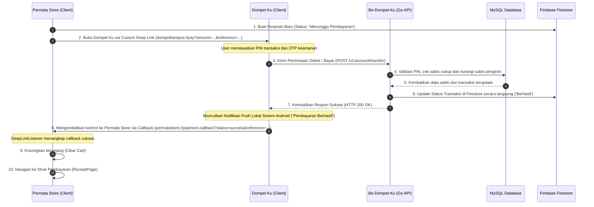

# Dokumentasi Arsitektur Sistem: Dompet Ku dan Permata Store

Dokumentasi ini menjelaskan secara mendalam arsitektur perangkat lunak, struktur folder, alur kerja (workflow), serta integrasi backend untuk ekosistem aplikasi Dompet Ku (E-Wallet), Permata Store (E-Commerce), dan Be-Dompet-Ku (Go Backend API).

---

## 1. Konsep Arsitektur Perangkat Lunak

### A. Dompet Ku (E-Wallet)
Aplikasi Dompet Ku menerapkan Clean Architecture yang memisahkan kode menjadi 3 lapisan utama untuk memastikan modularitas, kemudahan pengujian, dan independensi dari pustaka eksternal:

1. **Domain Layer (Core Business Logic):**
   - Lapisan terdalam dan paling murni yang tidak bergantung pada framework atau library eksternal.
   - Berisi Entities (model bisnis murni) dan Usecases (logika aplikasi/aturan bisnis).
   - Berisi definisi kontrak/antarmuka (Repositories Interface).

2. **Data Layer (Data Source Management):**
   - Mengimplementasikan antarmuka repositori dari Domain Layer.
   - Mengambil data dari internet (Remote Datasources via HTTP/Dio) atau penyimpanan lokal (Secure Storage/Shared Preferences).
   - Berisi Models yang merupakan serialisasi JSON dari entities.

3. **Presentation Layer (User Interface dan State Management):**
   - Menggunakan pattern BLoC (Business Logic Component) untuk memisahkan UI dan Logika Presentasi.
   - Terdiri dari Widgets, Pages, dan Blocs/Events/States.

---

### B. Permata Store (E-Commerce)
Aplikasi Permata Store menggunakan pendekatan Feature-Based Modular Architecture (Arsitektur Berbasis Fitur). Struktur folder dipecah berdasarkan domain fitur (seperti auth, cart, catalog, profile), di mana setiap fitur memiliki sub-folder models, pages, providers, dan widgets sendiri. Hal ini memudahkan pengembangan skala menengah agar komponen produk terisolasi dengan baik.

---

## 2. Struktur Folder Lengkap

### A. Dompet Ku App (dompet_ku/lib)
```text
lib/
├── core/                           # Utilitas bersama dan konfigurasi global
│   ├── constants/                  # Konstanta aplikasi (URL API, Key, dll.)
│   ├── error/                      # Kelas penanganan error dan exception
│   ├── network/                    # Client koneksi HTTP dan interceptor
│   ├── router/                     # Pengaturan navigasi rute (GoRouter)
│   ├── services/                   # Layanan sistem (Deep Link, Notifikasi Lokal)
│   ├── theme/                      # Definisi warna, font, dan gaya visual (AppColors)
│   └── utils/                      # Fungsi utilitas (Format Rupiah, dll.)
├── data/                           # Pengolahan data dan API
│   ├── datasources/                # Sumber data (Remote API dan Local Secure Storage)
│   ├── models/                     # Model data / representasi JSON
│   └── repositories/               # Implementasi Repositori dari Domain
├── domain/                         # Aturan bisnis murni (Domain Utama)
│   ├── entities/                   # Objek bisnis murni
│   ├── repositories/               # Abstraksi/Kontrak Repositori
│   └── usecases/                   # Kasus penggunaan aplikasi (Logika Bisnis)
├── presentation/                   # Lapisan UI dan State Management
│   ├── blocs/                      # State management menggunakan BLoC
│   ├── pages/                      # Halaman layar aplikasi (Screen/View)
│   └── widgets/                    # Komponen UI reusable (Button, TextField, dll.)
├── injection/                      # Dependency Injection (Service Locator - GetIt)
├── firebase_options.dart           # Konfigurasi Firebase Auto-generated
└── main.dart                       # Entry point aplikasi
```

---

### B. Permata Store App (uts_permatastore-main/lib)
```text
lib/
├── core/                           # Konfigurasi tema global
│   └── theme/                      # ThemeProvider (Mode Terang/Gelap)
├── features/                       # Fitur-fitur modular aplikasi
│   ├── auth/                       # Modul Otentikasi
│   │   ├── models/                 # Model User
│   │   └── pages/                  # Halaman Login / Registrasi
│   ├── cart/                       # Modul Keranjang dan Pembayaran
│   │   ├── models/                 # Model CartItem / CartModel
│   │   └── pages/                  # Halaman Keranjang, Detail Bayar, Waiting, Struk
│   ├── catalog/                    # Modul Katalog Produk dan Toko
│   │   ├── models/                 # Model Produk
│   │   ├── pages/                  # Halaman Home dan Detail Produk
│   │   ├── providers/              # State management katalog/favorite
│   │   └── widgets/                # Komponen card produk
│   └── profile/                    # Modul Profil dan Riwayat Pesanan
│       ├── pages/                  # Halaman Profil, Chat, dan Pesanan Saya
│       └── widgets/                # Komponen pendukung profil
└── main.dart                       # Konfigurasi awal dan Listener Deep Link Callback
```

---

### C. Be-Dompet-Ku (Go Backend API)
```text
Be-Dompet-Ku/
├── config/                         # Konfigurasi basis data dan koneksi (MySQL)
├── database/                       # Skema database dan file migrasi SQL
├── handlers/                       # Controller penangan HTTP request dan response
├── middleware/                     # Autentikasi JWT dan Logging CORS
├── models/                         # Definisi struktur tabel dan model GORM
├── routes/                         # Definisi endpoint API
├── services/                       # Logika bisnis backend dan Firebase Admin SDK
├── .env                            # Variabel lingkungan (port, DB credentials)
├── firebase-service-account.json  # Kunci privat akses Firestore
├── main.go                         # Entry point server Go
├── go.mod                          # Manajemen dependensi Go
└── go.sum                          # Checksum modul Go
```

---

## 3. Alur Kerja (Workflow) Integrasi Pembayaran

Berikut adalah alur integrasi end-to-end ketika pengguna melakukan transaksi pembayaran menggunakan metode Dompet Ku di Permata Store:



### Penjelasan Detail Langkah Alur Kerja:
1. **Pemicu Transaksi (Permata Store):** Pengguna menekan tombol "Konfirmasi & Bayar" dengan metode "Dompet Ku". Aplikasi membuat dokumen baru di Firebase Firestore pada koleksi `orders` dengan status `Menunggu Pembayaran`.
2. **Deep Linking (Outbound):** Permata Store membuka aplikasi Dompet Ku menggunakan skema URI kustom:
   `dompetkampus://pay?merchant_id=permata_store&merchant_name=Permata+Store&amount=170000&reference=[ORDER_ID]&callback=permatastore://payment-callback`
3. **Verifikasi dan Autentikasi (Dompet Ku):** Aplikasi Dompet Ku menerima parameter, mencocokkan jumlah bayar, meminta input PIN Keamanan/biometrik, dan mengirim verifikasi OTP jika diperlukan.
4. **Eksekusi Transaksi (Backend Go):** Dompet Ku memanggil endpoint backend `/v1/account/transfer`. Backend memproses pengurangan saldo pengirim (user) dan penambahan saldo penerima (merchant) di database MySQL secara transaksional (ACID).
5. **Firebase Synchronization (Backend dan Firestore):** Setelah transaksi database MySQL berhasil, backend Go menggunakan Firebase Admin SDK untuk memperbarui status pesanan pada dokumen Firestore `orders/[ORDER_ID]` langsung menjadi `Berhasil`.
6. **Notifikasi Sistem Android:** Aplikasi Dompet Ku memicu `NotificationService` lokal untuk memunculkan notifikasi push sistem Android yang menyatakan transaksi berhasil beserta nominalnya.
7. **Deep Linking (Inbound Callback):** Dompet Ku meluncurkan callback URI kembali ke Permata Store:
   `permatastore://payment-callback?status=success&reference=[ORDER_ID]`
8. **Navigasi Struk dan Finalisasi:** `DeepLinkListener` di Permata Store menangkap sinyal callback tersebut, membersihkan keranjang lokal, dan mengarahkan pengguna secara instan ke Halaman Struk Pembayaran (ReceiptPage) yang dinamis dan terperinci.

---

## 4. Informasi Pengembang

* **Nama:** Muhammad Arifin
* **NIM:** 1123150053
* **Kelas:** TI SE M 23
* **Mata Kuliah:** Pemrograman Mobile Lanjutan
* **Dosen Pengampu:** I Ketut Gunawan S.Kom, M.T.I
* **Tujuan Projek:** Ujian Akhir Semester (UAS) Semester 6 di Global Institute Bina Sarana Global.